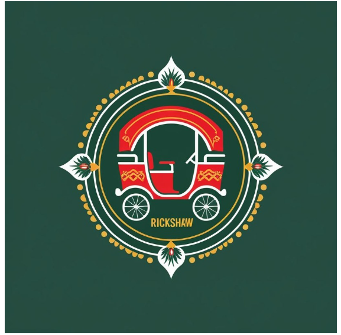

🚖 Rickshaw Booking & Management System

  
  

Rickshaw Booking & Management System is a comprehensive urban transportation platform designed to connect passengers, rickshaw drivers, and traffic authorities across Bangladesh. The system introduces modern technology to ensure safe rides, transparent pricing, proper regulation, and an improved commuting experience for all stakeholders.
📑 Table of Contents

🚀 Tools & Technologies

📋 Project Management

🏗️ Project Status

🌐 Live Demo

👥 Team Members

📘 Documentation

💻 Tech Stack

📜 Project Description

🛠️ Getting Started

🗺️ System Architecture

📊 Database Models

🚀 Tools & Technologies

           

📋 Project Management

Version Control: Git & GitHub

📁 **RickshawApp Folder Structure**

  
📂 frontend/ (Client-side app)

📄 index.html # Landing page
📄 login.html
📄 register.html
📄 dashboard.html
📂 css/
├── 📄 tailwind.css
└── 📄 custom.css
📂 js/
├── 📄 auth.js
├── 📄 booking.js
├── 📄 driver.js
├── 📄 payment.js
├── 📄 tracking.js
├── 📄 api.js
└── 📄 utils.js
📂 assets/
├── 📂 images/
└── 📂 icons/

  
📂 backend/ (Server-side app)

📄 server.js
📂 config/
📂 routes/
📂 controllers/
📂 models/
📂 middlewares/
📂 utils/
📄 package.json

css
Copy code

  
📂 database/ (DB dump)

📄 rickshawapp.mongodb # Optional

css
Copy code

  
📂 documentation/ (SRS, diagrams)

📄 SRS.pdf
📄 UseCaseDiagram.png
📄 ERDiagram.png
📄 SequenceDiagram.png
📄 ArchitectureDiagram.png

bash
Copy code

📄 .env.example  
📄 README.md  
📄 LICENSE

🌐 Live Demo

🚧 Coming Soon
(Local backend required for execution)

👥 Team Members
| Name                    | Role                                |
| ----------------------- | ----------------------------------- |
| Umme Nafisa Anzum Kotha | Project Lead / Full-Stack Developer |
            

| Category                      | Technology         | Purpose                                |
| ----------------------------- | ------------------ | -------------------------------------- |
| **Frontend**                  | HTML5              | Structuring web pages                  |
|                               | Tailwind CSS       | Responsive and modern UI design        |
|                               | JavaScript (ES6+)  | Client-side logic and interactivity    |
| **Backend**                   | Node.js            | Server-side JavaScript runtime         |
|                               | Express.js         | REST API development                   |
|                               | MongoDB            | NoSQL database                         |
|                               | Mongoose           | MongoDB object data modeling (ODM)     |
| **Authentication & Security** | JWT Authentication | Secure user login and session handling |
|                               | OTP Verification   | Two-step authentication                |
|                               | RBAC               | Role-Based Access Control for users    |
| **Payments & Utilities**      | SSLCommerz         | Online payment gateway integration     |
|                               | jsPDF              | PDF report and receipt generation      |

📜 Project Description

Rickshaw Booking & Management System modernizes the traditional rickshaw transport system in Bangladesh by introducing digital booking, driver verification, transparent pricing, and traffic monitoring.

| 🚀 Objective                           |
| -------------------------------------- |
| Improve passenger safety               |
| Ensure fair driver earnings            |
| Support traffic regulation authorities |
| Reduce fare disputes & inefficiencies  |

👤 Passenger Features

| 🔹 Feature                       | 🔸 Feature                   |
| -------------------------------- | ---------------------------- |
| Secure login & profile           | Ride booking (pickup & drop) |
| Real-time driver tracking        | OTP-based ride completion    |
| Fare negotiation & upfront price | Ride history & e-receipts    |
| Rating & review system           | Emergency SOS support        |

👨‍💼 Driver Features
| 🔹 Feature                    | 🔸 Feature                     |
| ----------------------------- | ------------------------------ |
| Driver verification & profile | Online / Offline availability  |
| Ride request management       | Earnings dashboard             |
| Ride history                  | Ratings & performance overview |

👮 Traffic Controller Features
| 🔹 Feature                       | 🔸 Feature                      |
| -------------------------------- | ------------------------------- |
| Driver monitoring & verification | Traffic violation case handling |
| Emergency ride oversight         | PDF report generation           |
| Regulatory analytics dashboard   | —                               |

🛠️ Getting Started| Requirement         | Version    |
| ------------------- | ---------- |
| **Node.js**         | v18+       |
| **MongoDB**         | v6+        |
| **Package Manager** | npm / yarn |

⚙️ Installation (Development)

git clone https://github.com/yourusername/rickshaw-booking-system.git
cd rickshaw-booking-system
npm install
➡ Backend Server:
http://localhost:3000

🗺️ System Architecture

📐 Architecture Overview

Client (Web Browser)
        ↓
 REST API (Express.js)
        ↓
   MongoDB Database
   
🔍 Responsibility Breakdown

| Layer        | Responsibility                      |
| ------------ | ----------------------------------- |
| **Frontend** | UI rendering & user interaction     |
| **Backend**  | Business logic, security & payments |
| **Database** | Persistent data storage             |

📊 Database Models

🗂️ Core Collections
| Collection                                     |
| ---------------------------------------------- |
| User (Passenger / Driver / Traffic Controller) |
| Ride                                           |
| DriverProfile                                  |
| Transaction                                    |
| TrafficCase                                    |
| MarketplaceListing                             |

🔗 Key Relationships
| Relationship                          |
| ------------------------------------- |
| One user → multiple rides             |
| One ride → one passenger & one driver |
| Transactions ↔ rides                  |
| Traffic cases ↔ drivers               |

🔮 Future Work

-Female-specific rides & female driver matching
-SOS emergency button with real-time alerts
-Discount & promo code system for passengers
-Integration with map & navigation APIs

📄 License

MIT License
(License file will be added)

 
<strong>Rickshaw Booking & Management System</strong>
 
Smart • Safe • Regulated Urban Transport
 
Built with ❤️ for Bangladesh
 
<em>Bangladesh University of Professionals</em>
 
<em>Department of ICT</em>
 

